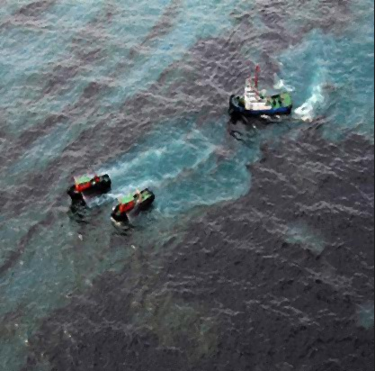

# Oil spill segmentation

Иногда на плавучих нефтедобывающих вышках происходят аварии, результатами которых является
разлив нефти. Обычно такие аварии характеризуются заметным изменением показателей на
вышке, например, перепадами давления. Для подтверждения разлива и фиксации его
характеристик снаряжается специалист на водном транспорте.

Цель данной работы - разработка автоматизированного решения для разведки водной местности
на предмет наличия разлива нефти на основе сегментации.

Задачи:
* Анализ, сбор открытых данных, разметка, аугментация.
* Формирование тренировочного и валидационного датасетов.
* Проверка гипотез.

# 1. Problem Statement

Предполагаемый итоговый результат работы включает в себя проверку различных гипотез,
оценку качества различных моделей для решения задачи сегментации. Также результатом работы
должна быть CV система, включающая в себя:
* версионирование данных
* логирование
* реестр моделей
* API
* настроенный CI/CD пайплайн.

**Имеется ряд бизнес метрик (... + требуется оценить/предусмотреть возможность масштабирования)**

В процессе проектирования и разработки решения могут возникать следующие проблемы и ограничения:
* Возможны проблемы с закупкой product-ready вычислительного оборудования на базе GPU.
Одна из проблем - большая стоимость по сегодняшнему рынку.
* В случае масштабирования решения на множество предприятий можно столкнуться с проблемой
закрытого контура и несколькими уровнями безопасности в рамках отдельных предприятий.
* Может понадобиться дополнительная продвинутая настройка автоматизированной передачи
видео до вычислительного центра. Может потребоваться дополнительный специалист со стороны
бизнес-заказчика.
* Может понадобиться дополнительная закупка и настройка БПЛА в случае, если бизнес-заказчиком
не предусмотрено своего подготовленного оборудования. 

Целевые данные, с которыми будет взаимодействовать система, могут быть либо наборами кадров
водной поверхности, либо видеозаписью всего облета местности. Пример данных:

# 2. Dataset

## 2.1. Analysis and Collection

Для обучения моделей сегментации необходимы отдельные кадры с соответствующей разметкой.
Для тестирования всей системы в целом нужны будут либо связные наборы фотографий либо
видеозаписи.

В открытом доступе, как правило, есть три типа данных для задач определения разлива нефти:

1. Табличные данные с описанием характеристик чрезвычайной ситуации. Решаемые задачи:
классификация.
2. Снимки со спутников в различных световых спектрах, например, в инфракрасном. Решаемые
задачи: детекция, сегментация, классификация.
3. Обычные фотоснимки/видеозаписи. Решаемые задачи: детекция, классификация.

В данной работе целевым типом данных является третий - набор фотографий поверхности воды
с предполагаемым разливом нефти. В результате первичного анализа открытых данных удалось
найти восемь различных наборов фотографий, либо размеченных под детекцию, либо не
размеченных вовсе [1-8] и четыре неразмеченных видеозаписи с дрона [9-12], кадры из
которых можно также использовать в качестве данных.

**Для дополнительной доразметки неразмеченных данных ... . ТЗ к разметчикам. Оценка стоимости**

## 2.2. Models train and test sets

**Train and test data**
**Data Augmentation**

## 2.3. Task validation data

**Input data**
**Expected analytics results**

# Reference

## Data

1. https://universe.roboflow.com/drons-kogn4/oil-8sfgp/dataset/5
2. https://universe.roboflow.com/daisycat1008-outlook-com/oil-spill-detection-q6qid/dataset/2
3. https://universe.roboflow.com/university-of-jeddah-yq1po/low-high-oilspill/dataset/2
4. https://universe.roboflow.com/uav/oil22/dataset/1
5. https://universe.roboflow.com/university-of-jeddah-yq1po/oil-spill-detection-lbyf9/dataset/1/images/?split=train
6. https://universe.roboflow.com/epp15class/a-pcgz1/dataset/1/images/?split=train
7. https://www.kaggle.com/datasets/damingo1/spill-data
8. https://www.kaggle.com/datasets/kothashyamreddy/oil-spills-image-data
9. https://www.youtube.com/watch?v=UC66_PGfQX4
10. https://www.youtube.com/watch?v=PVvsG06kKNg&t=48s
11. https://www.youtube.com/watch?v=r2KMb_0OS04
12. https://www.youtube.com/watch?v=0Ly0ktQbtCw

